# Analiza eksploracyjna

Wersja 1.0, 2026-08-29. Wszystkie liczby pochodzą z przebiegu
`python -m case_study.football.uruchom_eda` na `data/processed/model.parquet`
z 2026-08-24.

## Jak to odtworzyć

```
python -m case_study.football.uruchom_eda
```

Przebieg trwa około dziesięciu sekund, czyta wyłącznie `data/processed/`
i produkuje trzy rzeczy: czternaście figur w `reports/figures/eda/`, czternaście
tabel w `reports/tables/eda/` oraz plik `reports/tables/eda/fakty.json` ze 175
zmierzonymi liczbami. Każda liczba w tym dokumencie ma tam swój klucz, więc
raport da się sprawdzić pozycja po pozycji.

Logika siedzi w `case_study/football/eda.py`, po jednej funkcji na pytanie.
Funkcje są od siebie niezależne, więc dowolną można uruchomić osobno w konsoli.

Dwie zasady obowiązujące w całym etapie. Zbiór testowy pozostaje nietknięty —
każda ocena jakości w tym dokumencie liczona jest na zbiorze kalibracyjnym, żeby
protokół z E4 dostał zbiór testowy jako dane naprawdę niewidziane. Zbiór C
wchodzi tu wyłącznie cechami, zgodnie z D-14; jego zmienna celu zostaje zamknięta
do eksperymentu końcowego.

## Najważniejszy wynik etapu

Kolumna `dribble_success_percentage` zmienia znaczenie dokładnie na granicy
zbioru treningowego. Do sezonu 2021-2022 skuteczność dryblingu i wskaźnik odbioru
sumują się do stu procent w 98,7 procent wierszy, bo próba dryblingu kończy się
albo powodzeniem, albo odbiorem. Od sezonu 2022-2023 tożsamość ta obowiązuje
w 21,1 procent wierszy, a średnia suma spada z 99,97 na 88,65. Dostawca danych
dołożył trzecią kategorię zakończenia akcji.

Trening obejmuje sezony do 2021-2022 włącznie, a kalibracja i test zaczynają się
od 2022-2023. Model uczy się zatem tej cechy w jednej definicji i jest oceniany
w drugiej, przy czym granica pokrywa się co do sezonu z granicą podziału.
Szczegóły w sekcji A11.

## A1. Rozkład zmiennej celu

Skośność nominalna na Big 5 wynosi 3,47, a po `log1p` spada do −0,04 przy
kurtozie −0,42. Rozkład logarytmiczny jest symetryczny i nieco spłaszczony
względem normalnego, co potwierdza uzasadnienie D-03. Deflacja praktycznie nie
rusza kształtu: skośność celu realnego to −0,04.

Zakres na Big 5 obejmuje wartości od 50 tysięcy do 200 milionów euro przy medianie
6,0 miliona.

Rzecz mniej oczywista dotyczy ziarnistości. Cel przyjmuje 119 różnych wartości na
11 863 wierszach Big 5. Dziesięć najczęstszych progów zbiera 44,6 procent
obserwacji, dwanaście progów wystarcza na połowę masy, a czterdzieści na
dziewięćdziesiąt procent. Zmienna celu jest więc dyskretna, mimo że traktujemy ją
jako ciągłą.

**Konsekwencja.** Model przewiduje wartość na siatce, której gęstość maleje wraz
z ceną: progi biegną co ćwierć miliona w dolnych rejestrach i co dziesięć
milionów w górnych. Część błędu mierzonego przez RMSLE jest zaokrągleniem
redakcyjnym Transfermarktu i nie odnosi się do żadnej wielkości w świecie. Warto
to napisać przy dyskusji o dolnym ograniczeniu osiągalnego błędu w W1
(poprawność predykcyjna, mierzona RMSLE i MdAPE).

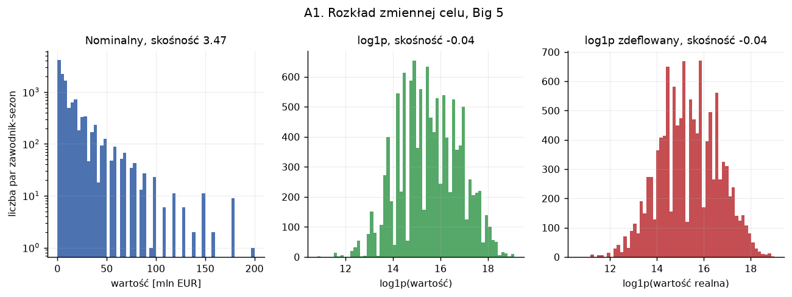

*Ten sam cel w trzech wariantach. Panel nominalny ma oś Y w skali
logarytmicznej, bo inaczej ogon do 200 milionów jest nieczytelny. Skośność spada
z 3,47 do −0,04 po `log1p`, a deflacja zostawia kształt bez zmian.*

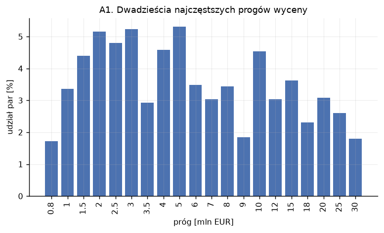

*Udział par zawodnik-sezon przypadający na dwadzieścia najczęstszych progów.
Widać tu siatkę redakcyjną Transfermarktu: gęstą co ćwierć miliona w dolnych
rejestrach, rzadką co dziesięć milionów w górnych.*

Tabela: `a1_progi_wyceny.csv`.

## A2. Skuteczność deflacji

Test polega na sprawdzeniu, czy po zdeflowaniu poziom celu jest płaski w czasie.

Na sezonach treningowych rozstęp średniej log-wartości spada z 0,263 do 0,047,
czyli pięć i pół raza. Deflacja robi dokładnie to, do czego została zbudowana.

Na wszystkich sześciu sezonach rozstęp spada z 0,325 do 0,158. Reszta bierze się
z konstrukcji: indeks liczony jest wyłącznie na treningu (etap 9), a sezon
kalibracyjny, testowy i zbiór C dostają współczynnik ostatniego sezonu
treningowego. Rynek w tym czasie rósł dalej, więc płaskie przedłużenie zostawia
około 0,15 jednostki logarytmicznej niezdjętego poziomu, co odpowiada mniej
więcej 16 procentom.

Inflacja nominalna między sezonem 2017-2018 a 2023-2024 wynosi 38,4 procent, co
zgadza się z liczbą 38 procent z `02-dane.md`.

**Konsekwencja.** Odchylenie od płaskiej linii poza treningiem jest znane co do
mechanizmu i nie wskazuje błędu w liczeniu indeksu. Przy porównaniu celu
nominalnego i zdeflowanego w E5 (D-04) trzeba pamiętać, że wariant zdeflowany
zdejmuje poziom tylko częściowo, i to systematycznie mniej właśnie na zbiorze,
na którym się go ocenia.

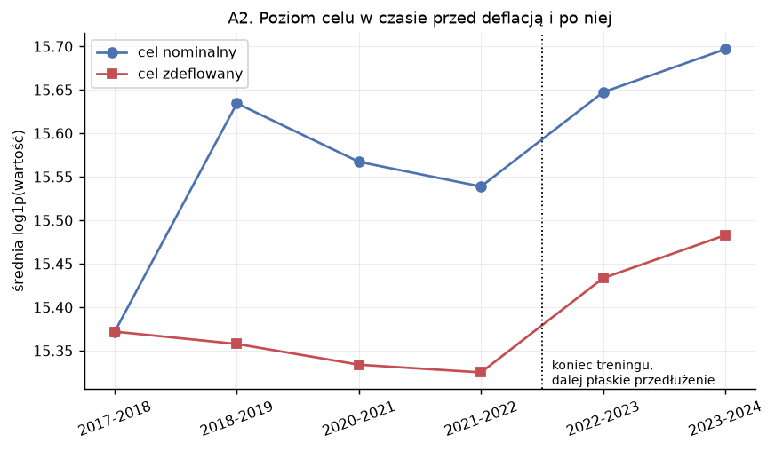

*Średnia log-wartość w kolejnych sezonach, dwie linie: przed deflacją i po niej.
Na sezonach treningowych linia po deflacji jest płaska (rozstęp 0,047). Od
2022-2023 odrywa się w górę, bo indeks zamrożony na ostatnim sezonie treningowym
przestaje nadążać za rynkiem.*

Tabela: `a2_poziom_w_czasie.csv`.

## A3. Krzywa wiek-wartość

Plan stawiał to pytanie ostro: kształt inny niż paraboliczny czyni cechę
`wiek_do_kw` ozdobnikiem. Odpowiedź wymaga rozdzielenia dwóch rzeczy.

Parabola broni się liczbowo. Sam wiek liniowo daje R² 0,118, parabola 0,174,
a średnia w każdym roczniku — model nieparametryczny, czyli sufit osiągalny
dowolną funkcją samego wieku — daje 0,180. Parabola zbiera więc 96,6 procent
informacji o wieku, a jej wierzchołek wypada w wieku 23,5 roku. Rozbicie na
pozycje daje wierzchołki 23,0 dla napastników, 23,7 dla obrońców i 23,8 dla
pomocników. Cecha `wiek_do_kw` ma uzasadnienie i zostaje.

Kształt odwróconego U w tych danych nie występuje. Najdroższym rocznikiem
w zbiorze są osiemnastolatkowie: mediana 10,0 miliona euro wobec 8,25 miliona
u dwudziestopięciolatków. Krzywa ma raczej postać plateau między 21 a 27 rokiem
życia, poprzedzonego wysokim punktem u najmłodszych i zakończonego stromym
spadkiem po trzydziestce.

Wyjaśnienie leży w filtrze. Osiemnastolatków w zbiorze jest 79 i mają medianę 633
minut wobec 1 742 minut u dwudziestopięciolatków. Próg 225 minut przepuszcza
z tego rocznika wyłącznie tych, którzy dostają grę w Big 5, czyli talenty już
wycenione wysoko. Reszta rocznika gra w rezerwach i w zbiorze się nie pojawia.

**Konsekwencja.** Model dostaje próbę, w której młody wiek jest sygnałem
wyjątkowości. Predykcje dla młodych zawodników będą zawyżone wobec populacji
młodych zawodników w ogóle i poprawne wobec populacji młodych zawodników
grających w Big 5. Jest to ograniczenie zakresu stosowalności i należy do W5
(sprawiedliwość, mierzona parytetem jakości i parytetem obciążenia między
grupami) w rozbiciu na przedziały wieku.

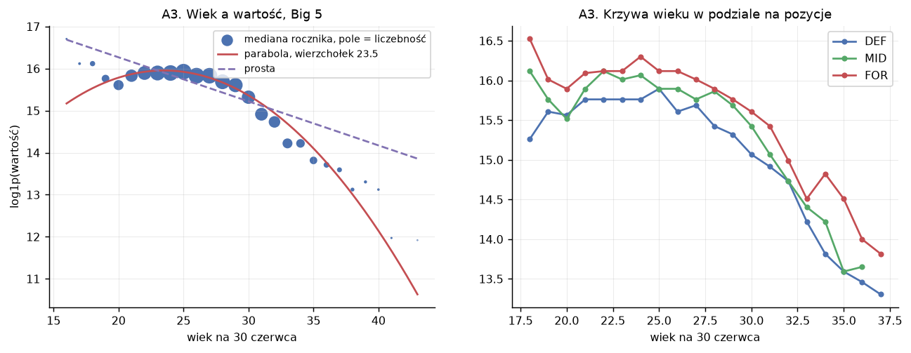

*Po lewej chmura par zawodnik-sezon z dopasowaną parabolą, wierzchołek w wieku
23,5 roku. Po prawej te same krzywe rozbite na pozycje. Kształt to plateau
między 21 a 27 rokiem życia z wysokim punktem u osiemnastolatków — efekt filtra
225 minut opisany wyżej.*

Tabela: `a3_krzywa_wieku.csv`.

## A4. Struktura panelu

Zbiór obejmuje 5 310 zawodników, średnio 2,58 sezonu na zawodnika. Rozkład jest
mocno prawoskośny: 1 933 zawodników (36,4 procent) pojawia się w jednym sezonie,
a 445 przechodzi przez wszystkie sześć. Ogon jednosezonowy to jednak tylko
14,1 procent wierszy, bo zawodnicy powtarzający się wnoszą po kilka wierszy każdy.

Sam zbiór treningowy to 7 924 wiersze w 3 598 grupach, czyli 2,20 wiersza na
zawodnika.

**Konsekwencja dla E4.** GroupKFold po `player_id` ma sens: grup jest 3 598 przy
pięciu foldach, więc podział pozostaje stabilny, a jednocześnie 2,2 wiersza na
grupę oznacza realne ryzyko wycieku przy podziale losowym. Liczby te wchodzą
wprost do `splits.py`.

Przy okazji zmierzona została lepkość wyceny. Par z dostępną wyceną z sezonu
poprzedniego jest 7 776, a na zbiorze testowym pokrycie wynosi 72,0 procent, co
potwierdza liczbę z D-06. Korelacja logarytmów rok do roku to 0,898, czyli R²
0,807 dla samego przepisania wartości. W 13,3 procent przypadków Transfermarkt
zostawia wycenę identyczną co do centa.

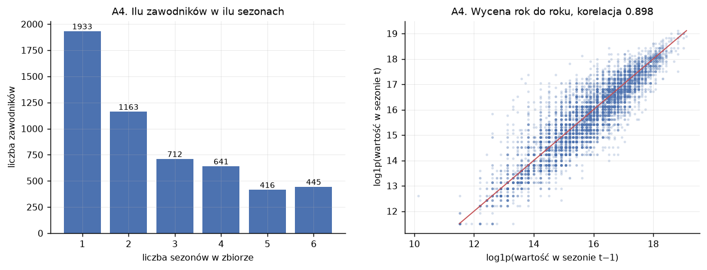

*Po lewej ilu zawodników pojawia się w ilu sezonach: 1 933 tylko raz, 445 we
wszystkich sześciu. Po prawej wycena rok do roku jako chmura punktów; korelacja
logarytmów 0,898 pokazuje, jak dużo wnosi samo przepisanie zeszłorocznej
wartości.*

Tabela: `a4_sezonow_na_zawodnika.csv`.

## A5. Cel i cechy w podgrupach

Tabela podaje dwie liczby na grupę: medianę surową oraz premię warunkową. Premia
warunkowa to średnia reszty po dopasowaniu regresji na wieku, kwadracie wieku,
pozycji, lidze i sezonie, z pominięciem analizowanej zmiennej. Reszta jest
w skali logarytmicznej, więc po przekształceniu przez funkcję wykładniczą czyta
się ją jako mnożnik.

| grupa | par | mediana [mln EUR] | mnożnik warunkowy |
|---|---|---|---|
| Premier League | 2 354 | 15,0 | 2,07 |
| Bundesliga | 2 142 | 5,0 | 0,89 |
| La Liga | 2 481 | 4,0 | 0,89 |
| Serie A | 2 513 | 5,0 | 0,87 |
| Ligue 1 | 2 373 | 4,0 | 0,70 |
| FOR | 2 965 | 7,5 | 1,25 |
| MID | 4 067 | 6,0 | 1,04 |
| DEF | 4 831 | 5,0 | 0,84 |
| AMERYKA\_PLD | 1 292 | 7,5 | 1,40 |
| EUROPA | 8 694 | 6,0 | 1,00 |
| RESZTA | 1 877 | 5,0 | 0,81 |

Liga jest najsilniejszym pojedynczym czynnikiem kontekstowym. Zawodnik Premier
League wart jest 2,07 raza tyle co porównywalny zawodnik z ligi przeciętnej,
a zawodnik Ligue 1 — 0,70 raza tyle. Rozpiętość między skrajnymi ligami sięga
zatem czynnika trzy przy tym samym wieku, tej samej pozycji i tym samym sezonie.

Region zachowuje wyraźną premię po kontroli obserwowalnych: Ameryka Południowa
+40 procent, reszta świata −19 procent, Europa neutralnie. Napastnicy są warci
1,25 raza tyle co porównywalni obrońcy.

**Konsekwencja dla W5.** Jest to wstępna diagnoza postawiona przed jakimkolwiek
modelem, więc mierzy obciążenie wycen rynku. Model wierny tym danym odtworzy
premię regionalną i pokaże zerową dysproporcję błędu, powielając jednocześnie
strukturę wycen. Język raportowania z `01-projekt.md` — wnioski formułujemy
o rynku i jego wycenach — ma tu bezpośrednie zastosowanie.

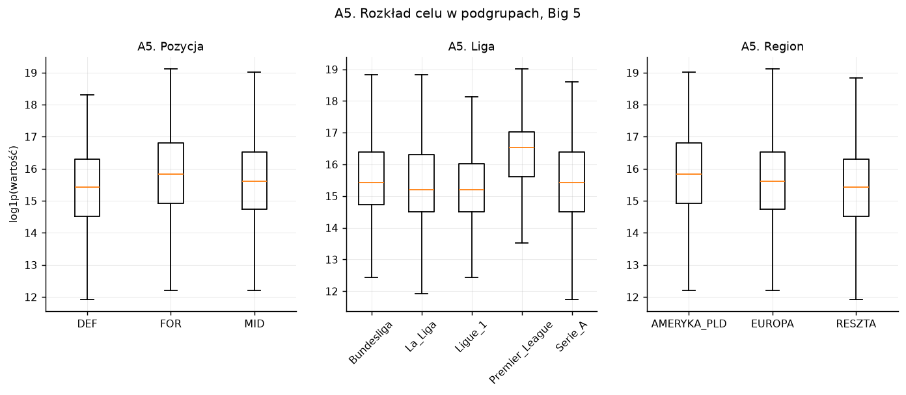

*Rozkład log-wartości w trzech podziałach: pozycja, liga, region. Wykres
pudełkowy z pominięciem obserwacji odstających, więc pudełko obejmuje połowę
środkową grupy, a wąsy sięgają półtora rozstępu ćwiartkowego.*

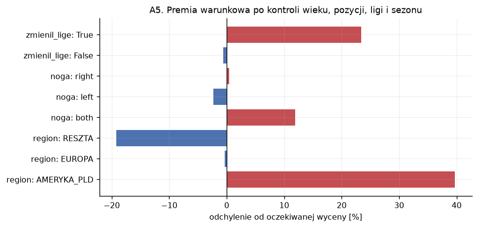

*Premia warunkowa, czyli średnia reszty po odjęciu wpływu wieku, pozycji, ligi
i sezonu. Słupek mówi, ile grupa dokłada ponad to, co wyjaśnia sama jej
charakterystyka.*

Tabela: `a5_podgrupy.csv`.

## A6. Korelacje między cechami i koszt filtra

Korelacje liczone są wyłącznie na zbiorze treningowym, bo filtr korelacyjny
w Pipeline będzie fitowany na treningu i tutaj odtwarzamy jego decyzje. Cech
ciągłych jest 95 (87 statystyk `_p90` plus 8 wskaźników procentowych), mediana
korelacji bezwzględnej wynosi 0,207.

| próg | par powyżej progu | cech usuwanych przez filtr |
|---|---|---|
| 0,99 | 5 | 4 |
| 0,95 | 19 | 11 |
| 0,90 | 46 | 23 |

Dwie najsilniejsze pary to `live_ball_touches_p90` z `total_touches_p90`
(korelacja 1,000) oraz `dribble_success_percentage` z `tackled_perecentage`
(0,9995). Obie omówione są wśród ciekawostek, bo mają źródło w konstrukcji
danych, a nie w piłce.

### Ile tu naprawdę jest cech

Sama macierz 95 na 95 pokazuje jedynie, że gdzieś są jasne plamy. Zadajemy jej
więc dwa konkretne pytania.

Pierwsze: w ile grup wzajemnie zamiennych cech rozpada się ten zestaw.
Grupowanie hierarchiczne przy progu średniej korelacji bezwzględnej 0,5 daje
28 bloków, z czego 15 jest jednoelementowych, a 68 cech siedzi w siedmiu blokach
liczących po trzy cechy i więcej:

| blok | cech | reprezentant | czym jest |
|---|---|---|---|
| 28 | 21 | `total_completed_p90` | objętość gry przy piłce: podania, dotknięcia, prowadzenia, dystanse |
| 21 | 15 | `touches_attacking_third_p90` | kreowanie: drybling, podania kluczowe, xAG, asysty |
| 23 | 14 | `shots_p90` | oś pozycji: strzały i xG na jednym końcu, wybicia i przechwyty na drugim |
| 16 | 8 | `tackles_p90` | pojedynki obronne |
| 27 | 4 | `long_completed_p90` | gra długą piłką i stałe fragmenty |
| 10 | 3 | `crosses_p90` | dośrodkowania |
| 12 | 3 | `corner_kicks_p90` | rzuty rożne |

Blok 23 wymaga komentarza, bo grupujemy po module korelacji. Trafiają do niego
cechy silnie ujemnie skorelowane: `shots_p90` z `clearances_p90` mają korelację
−0,582, a `xG_p90` z `touches_defensive_third_p90` −0,602. Ten blok opisuje
jedną oś napastnik-obrońca, a nie jeden rodzaj akcji.

Drugie pytanie: ile niezależnych wymiarów te 95 kolumn dostarcza. Wartości własne
macierzy korelacji odpowiadają jednoznacznie. Pierwsza składowa główna tłumaczy
28,5 procent wariancji cech, szesnaście składowych wystarcza na 80 procent,
dwadzieścia osiem na 90 procent, a wymiarowość partycypacyjna wynosi 8,0.

**Co z tego wynika.** Zbiór 95 statystyk boiskowych jest pomiarem mniej więcej
szesnastu rzeczy, a jego zmienność w największym stopniu opisuje jeden ogólny
wymiar zaangażowania w grę. Ma to trzy konsekwencje. Ranking ważności w W4 będzie
rozdzielał wkład wewnątrz bloków w sposób zależny od ziarna, bo cechy w bloku
niosą tę samą informację — dlatego rozkład tau Kendalla z W4 jest tu właściwym
narzędziem, a pojedynczy ranking nie jest. Modele liniowe dostają układ silnie
współliniowy, co czyni regularyzację warunkiem sensowności współczynników.
Deklarowana liczba 105 cech przecenia natomiast bogactwo opisu zawodnika i warto
podać obok niej liczbę efektywną.

Figura `a6_korelacje.png` pokazuje obie odpowiedzi obok siebie: po lewej macierz
uporządkowana grupowaniem, z obrysowanymi blokami od trzech cech wzwyż, po prawej
krzywa skumulowanej wariancji z zaznaczonymi progami.

Nowy pomiar, spoza listy E3: ile filtr faktycznie kupuje. Model liniowy
z regularyzacją grzbietową, uczony na treningu i oceniany na kalibracji, daje R²
0,582 bez filtra. Po zastosowaniu filtra przy progu 0,95 wynik spada do 0,429.
Sprawdzony został też wariant, w którym z każdej pary zostaje cecha silniej
skorelowana z celem — daje 0,418, czyli tyle samo w granicach różnicy.

**Konsekwencja dla E5.** Filtr korelacyjny przy progu 0,95 kosztuje około
0,15 R² i reguła wyboru cechy z pary tego nie zmienia. Regularyzacja grzbietowa
radzi sobie ze współliniowością samodzielnie, a cechy skorelowane w 0,95 wciąż
niosą własną, nieredundantną resztę informacji. Uzasadnieniem dla filtra pozostaje
stabilność wyjaśnień w W4 (wyjaśnialność, mierzona rozkładem tau Kendalla między
rankingami SHAP), gdzie dwie cechy skorelowane w 0,95 dzielą przypisaną ważność
w sposób zależny od ziarna. Filtr należy więc uzasadniać kosztem W1 płaconym za
zysk w W4, a nie poprawą dokładności — i ten koszt jest teraz zmierzony.

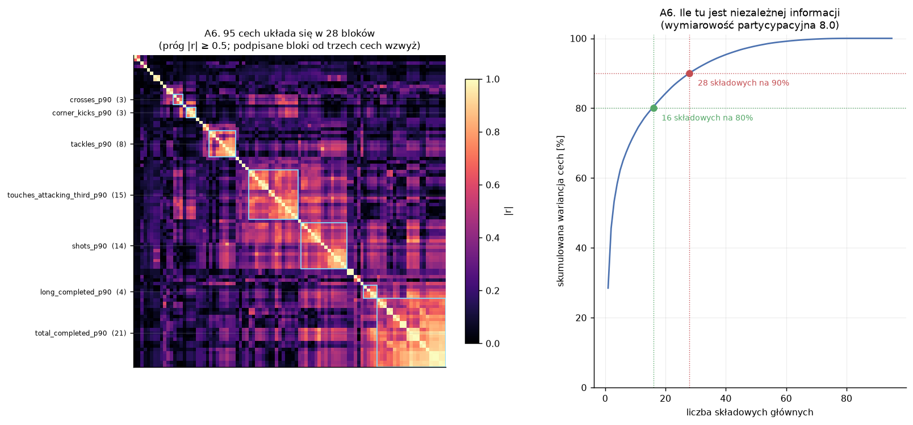

*Jasność w macierzy po lewej odpowiada wartości bezwzględnej korelacji, a
kolejność wierszy pochodzi z grupowania hierarchicznego, dzięki czemu bloki
cech układają się przy przekątnej.*

Tabele: `a6_pary_skorelowane.csv`, `a6_bloki_cech.csv`.

## A7. Mapa braków

Braki są skoncentrowane i koncentracja ma sens merytoryczny.

`dribble_success_percentage` i `tackled_perecentage` mają po 295 braków, z czego
4,88 procent przypada na obrońców wobec 0,17 procent na napastników — iloraz
28,7. Obie kolumny dzielą mianownik `dribbles_attempted`, więc brak oznacza
zawodnika, który przez cały sezon nie podjął ani jednej próby dryblingu.
`successful_dribbler_tackle_percentage` zachowuje się odwrotnie: 0,89 procent
u napastników wobec 0,11 u obrońców, bo napastnik rzadko broni przed dryblingiem.
Test chi-kwadrat odrzuca losowość rozkładu braków dla czterech z siedmiu kolumn.

Drugim wymiarem koncentracji jest wolumen gry. Mediana minut przy braku wskaźnika
dryblingu wynosi 590 wobec 1 559 przy wskaźniku obecnym.

**Konsekwencja dla O-3 i D-09.** Imputacja medianą podstawi obrońcy grającemu
mało wartość typową dla zawodnika, który drybluje regularnie. Jest to obciążenie
grupowe wprowadzone przez preprocessing, mierzalne w W5. Flaga „zero prób" obok
imputacji przestaje być kosmetyką i staje się poprawką merytoryczną — dane
przemawiają za wariantem z flagą.

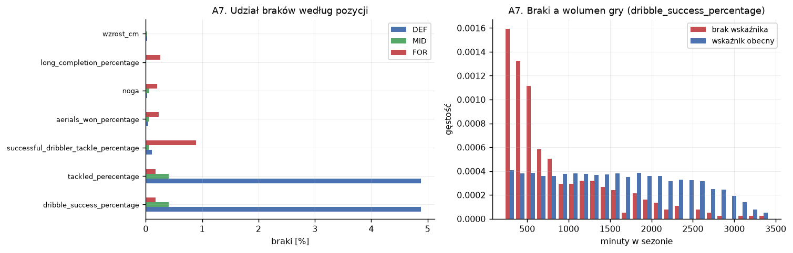

*Po lewej udział braków w rozbiciu na pozycje. Po prawej rozkład wolumenu gry
dla `dribble_success_percentage`: braki siedzą przy dolnej krawędzi minut, więc
biorą się z braku prób w mianowniku.*

Tabela: `a7_mapa_brakow.csv`.

## A8. Wrażliwość na próg minut

| próg | par | udział | do 21 lat | mediana [mln] | zmienność cech `_p90` |
|---|---|---|---|---|---|
| 225 | 11 863 | 100,0% | 10,9% | 6,0 | 0,751 |
| 450 | 10 817 | 91,2% | 9,6% | 6,0 | 0,726 |
| 900 | 8 872 | 74,8% | 8,1% | 8,0 | 0,711 |
| 1 350 | 6 916 | 58,3% | 6,8% | 9,0 | 0,712 |

Podnoszenie progu działa dokładnie tak, jak zapowiada D-08, i widać wszystkie
trzy efekty naraz. Próba się kurczy. Skład przesuwa się ku starszym: udział
zawodników do 21 roku życia spada z 10,9 do 6,8 procent. Skład przesuwa się też
ku droższym: mediana rośnie z 6 do 9 milionów euro. Zmienność cech `_p90` spada
o 5,3 procent między progiem 225 a 900 i dalej się stabilizuje.

**Ograniczenie tego pomiaru.** Zbiór modelowy jest już odfiltrowany progiem 225,
więc wariant „próg 0" z listy E3 wymaga ponownego przebiegu pipeline z innym
`MIN_MINUT`. Zmierzony kierunek jest jednoznaczny i pozwala ocenić, że próg nie
jest parametrem obojętnym; pełna analiza wrażliwości włącznie z zerem pozostaje
do wykonania przy okazji następnego przebiegu przygotowania danych.

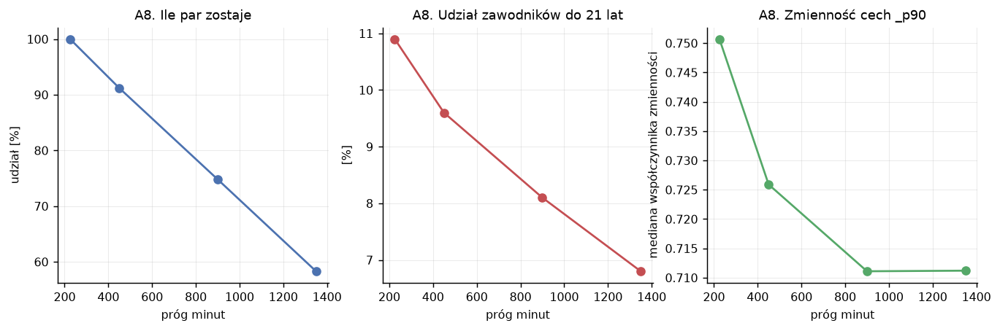

*Oś pozioma we wszystkich trzech panelach to próg minut. Kolejno: ile par
zostaje w zbiorze, jaki jest udział zawodników do 21 lat i jak zachowuje się
zmienność cech `_p90`. Panele czyta się razem, bo podnoszenie progu kupuje
stabilność cech kosztem liczebności i reprezentacji młodych.*

Tabela: `a8_prog_minut.csv`.

## A9. Sufit informacyjny

Bloki cech dokładane kolejno, ocena na zbiorze kalibracyjnym, model liniowy
z regularyzacją grzbietową o alfie wybranej walidacją krzyżową na treningu.

| blok | cech | R² | MAE (log) |
|---|---|---|---|
| M0a mediana globalna | 0 | −0,032 | 1,033 |
| wiek i kwadrat wieku | 2 | 0,167 | 0,927 |
| + pozycja i liga | 4 | 0,305 | 0,829 |
| + region i noga | 6 | 0,313 | 0,821 |
| + wolumen gry i wzrost | 9 | 0,490 | 0,702 |
| + wszystkie statystyki gry (Ridge) | 105 | 0,582 | 0,631 |
| to samo, HistGradientBoosting | 105 | 0,724 | 0,505 |
| same statystyki gry, bez kontekstu | 95 | 0,204 | 0,903 |
| sam wolumen gry | 2 | 0,156 | 0,926 |

Sam kontekst — wiek, pozycja, liga, region, noga, czyli sześć zmiennych
niewymagających ani jednego meczu — daje R² 0,313. Modele z E5 startują więc
z wysokiego pułapu odniesienia i wynik R² rzędu 0,5 oznaczałby, że statystyki gry
wnoszą niewiele ponad metryczkę zawodnika.

Realistyczne oczekiwanie dla modeli z E5 leży w okolicach 0,72 na zbiorze
kalibracyjnym, przy czym HistGradientBoosting osiąga tę wartość bez strojenia.
Przewaga drzew nad modelem liniowym wynosi 0,142 R² i jest większa, niż wynikałoby
z samej nieliniowości — model liniowy jest tu dodatkowo obciążony cechami
o zmienionej definicji, opisanymi w A11.

**Konsekwencja i ciekawostka w jednym.** Sam wolumen gry, czyli minuty i mecze,
podnosi R² o 0,177 ponad blok kontekstowy. Wszystkie 95 statystyk boiskowych
dokłada ponad to 0,092. Informacja „ile grał" jest więc dla wyceny cenniejsza niż
komplet informacji „jak grał". Trener wystawiający zawodnika w składzie podejmuje
decyzję opartą na tej samej wiedzy, którą wycenia rynek, więc minuty są skrótem
przez cały proces oceny — i jednocześnie zmienną, która jest skutkiem wartości
zawodnika w tym samym stopniu, w jakim jest jej przyczyną.

**Konsekwencja dla W4.** Ranking SHAP prawie na pewno postawi `minuty_sezon` na
czele. Interpretacja „minuty budują wartość" byłaby odwróceniem kierunku
przyczynowości i tego zdania trzeba w pracy uniknąć.

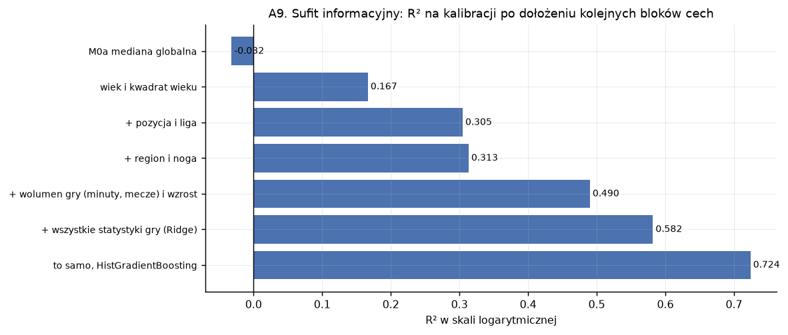

*R² na zbiorze kalibracyjnym, liczone narastająco: każdy słupek to wynik po
dołożeniu kolejnego bloku cech do poprzednich. Długość słupka pokazuje, gdzie
kończy się realny przyrost informacji.*

Tabela: `a9_sufit_informacyjny.csv`.

## A10. Przesunięcie rozkładów cech

Zgodnie z D-14 dotykamy wyłącznie cech zbioru C. Mierzymy dwa przesunięcia obok
siebie: test wobec zbioru C, czyli przejście do innej ligi, oraz trening wobec
testu, czyli sam upływ czasu wewnątrz Big 5.

Na 99 ocenionych cech przesunięcie do zbioru C jest duże (PSI powyżej 0,25) dla
dwóch cech, umiarkowane (0,10–0,25) dla dziewiętnastu i pomijalne dla
siedemdziesięciu ośmiu. Mediana PSI wynosi 0,033.

Największe przesunięcia dotyczą prowadzenia piłki i podań krótkich:
`total_carry_distance_p90` (PSI 0,266), `mecze` (0,260), `fouls_committed_p90`
(0,240), `short_attempted_p90` (0,237), `carries_p90` (0,230). Czyta się to jako
inny styl gry: w Primeira Lidze więcej się prowadzi piłkę i częściej fauluje, przy
mniejszej liczbie rozegranych meczów w sezonie.

Mediana przesunięcia czasowego wewnątrz Big 5 wynosi 0,013, czyli około dwa i pół
raza mniej niż przesunięcie ligowe. Rozkłady cech w zbiorze C pozostają zatem
w większości parytetowe, co potwierdza zapis w D-14.

Wyjątkiem jest `dribble_success_percentage`, dla którego przesunięcie czasowe
wewnątrz Big 5 wynosi 0,529 i przewyższa każde przesunięcie do zbioru C.
Ta obserwacja doprowadziła do analizy A11.

**Konsekwencja dla E11.** Skoro cechy przesuwają się umiarkowanie, a poziom celu
w Primeira Lidze leży niżej o około 1,7 jednostki logarytmicznej (liczba zapisana
w D-14), to degradacja w eksperymencie końcowym będzie zdominowana przez składnik
obciążenia. Rozkład z D-13 jest tym samym warunkiem sensowności głównego wyniku
pracy.

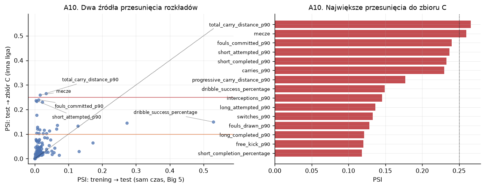

*Po lewej każda cecha to jeden punkt: oś pozioma mierzy przesunięcie wywołane
samym upływem czasu (trening wobec testu), oś pionowa przesunięcie wywołane
zmianą dziedziny (test wobec zbioru C). Obie osie mają tę samą skalę, więc
przerywana przekątna rozdziela cechy, w których przeważa jedno źródło, od tych
z przewagą drugiego; poziome linie zaznaczają progi PSI. Po prawej cechy
o największym PSI wobec zbioru C.*

Tabela: `a10_dryf_cech.csv`.

## A11. Nieciągłości w źródle

Analiza spoza listy E3. Powstała, gdy w A10 okazało się, że jedna cecha ma
przesunięcie czasowe wewnątrz Big 5 większe niż jakiekolwiek przesunięcie do
Portugalii.

Metoda: średnia sezonowa każdej cechy, standaryzowana odchyleniem tej cechy
między zawodnikami, żeby skoki różnych cech dało się porównać. Rozróżniamy dwa
kształty. Trwały krok to różnica poziomu dwóch ostatnich i dwóch pierwszych
sezonów; taki kształt pasuje do zmiany definicji u dostawcy danych. Anomalia
jednosezonowa to odchylenie sezonu 2020-2021 od średniej jego sąsiadów; taki
kształt pasuje do warunków konkretnego sezonu.

Wynik: trzynaście cech ma trwały krok powyżej 0,2 odchylenia standardowego,
a tylko jedna ma taką anomalię jednosezonową. Dominującym wzorem jest trwałe
przesunięcie poziomu. Uwaga porządkowa: 58 z 95 cech ma swój największy skok
w sąsiedztwie sezonu 2020-2021, jednak skoki te są w większości małe, więc sezon
pandemiczny wypada mniej groźnie, niż sugeruje ta pierwsza liczba.

### Zmiana definicji dryblingu

Najsilniejszy przypadek to `dribble_success_percentage`, z trwałym krokiem
−0,647 odchylenia. Średnia skuteczność dryblingu spada z 57,2 procent w sezonie
2021-2022 na 47,3 procent w 2022-2023 i na tym poziomie zostaje. Liczba prób
dryblingu się nie zmienia (32,1 wobec 29,9 na zawodnika), a spada liczba
dryblingów zaliczonych jako udane (14,5 wobec 15,6).

Dowód rozstrzygający daje tożsamość księgowa. Próba dryblingu ma dwa możliwe
zakończenia, powodzenie albo odbiór, więc oba wskaźniki powinny sumować się do
stu.

| sezon | średnia suma wskaźników | udział wierszy z sumą równą 100 | korelacja pary |
|---|---|---|---|
| 2017-2018 | 99,92 | 97,3% | −0,999 |
| 2018-2019 | 99,95 | 98,4% | −0,999 |
| 2020-2021 | 99,98 | 98,7% | −1,000 |
| 2021-2022 | 99,97 | 98,7% | −1,000 |
| 2022-2023 | 88,65 | 21,1% | −0,830 |
| 2023-2024 | 90,91 | 26,4% | −0,843 |

Tożsamość obowiązuje przez cztery sezony i przestaje obowiązywać w piątym.
Dostawca dołożył trzecią kategorię zakończenia akcji, przez co obie kolumny
zmieniły znaczenie.

Podobnie, choć łagodniej, zachowują się przechwyty: `interceptions_p90` spada
monotonicznie z 1,158 na 0,800, czyli o 31 procent w sześć sezonów.

Osobny wzór ma `through_balls_p90`: załamuje się wyłącznie w sezonie 2020-2021
o 0,39 odchylenia i wraca do poprzedniego poziomu. Jest to jedyna cecha
z wyraźną anomalią jednosezonową.

**Konsekwencja — najpoważniejsza z całego etapu.** Granica zmiany biegnie między
sezonem 2021-2022 a 2022-2023, czyli dokładnie tam, gdzie kończy się trening
i zaczyna kalibracja. Model uczy się cechy w starej definicji na stu procentach
danych treningowych i jest oceniany w nowej definicji na stu procentach danych
kalibracyjnych i testowych. Dla modelu jest to przesunięcie dziedziny ukryte
wewnątrz Big 5, nierozróżnialne od zmiany zachowania zawodników. Zbiór C jest tu
bez winy.

Do rozstrzygnięcia w E4 lub E5, zapisane jako O-6 w `04-plan.md`: usunąć cechy
z trwałym krokiem, zostawić je z adnotacją, czy wyrównać poziom per sezon.

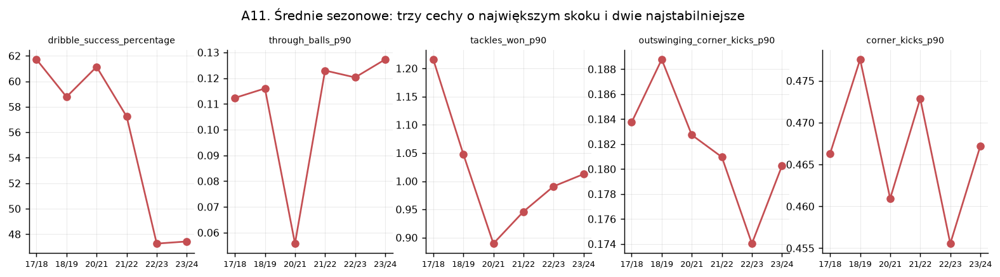

*Średnia sezonowa cechy, panel na cechę. Trzy pierwsze mają największy skok
między sąsiednimi sezonami, dwie ostatnie służą za kontrolę. Załamanie linii na
granicy 2021-2022 i 2022-2023 to sygnał zmiany definicji po stronie dostawcy.*

Tabele: `a11_zlom_definicyjny.csv`, `a11_tozsamosc_dryblingu.csv`.

## Ciekawostki

Fakty nieoczywiste, zebrane w jednym miejscu. Każdy wyszedł przy okazji innego
pytania i każdy zmienia sposób czytania zbioru.

**1. Transfermarkt wycenia falami.** W zbiorze jest 184 różnych dat wyceny, ale
dwadzieścia najczęstszych zbiera 56,9 procent wszystkich obserwacji. W jednym
dniu, 7 czerwca 2022, powstało 414 wycen. Mediana odległości od 30 czerwca
wynosi −24 dni. „Data wyceny" jest więc datą akcji redakcyjnej prowadzonej
hurtowo przed początkiem okna transferowego, a nie momentem, w którym rynek
zmienił zdanie o zawodniku. Okno kwiecień-wrzesień z `02-dane.md` trafia dokładnie
w te fale.

**2. Dwie kolumny opisują to samo.** `total_touches` i `live_ball_touches` są
identyczne w 87,4 procent wierszy, różnią się średnio o 0,29 dotknięcia na cały
sezon, maksymalnie o 13, a ich korelacja po normalizacji na 90 minut wynosi
0,999996. Schemat FBref obiecuje różnicę — dotknięcia przy piłce w grze wobec
wszystkich dotknięć — której dane nie zawierają. Para przetrwała odsiew
redundancji z etapu 1, bo obie kolumny pochodzą z tej samej tabeli i nie było ich
na liście `KOLUMNY_ZREDUNDOWANE`.

**3. Druga para bliźniacza wynika z definicji.** `dribble_success_percentage`
i `tackled_perecentage` sumują się do stu w 72,8 procent wierszy całego zbioru,
przy średniej sumie 96,47. Dzielą mianownik i opisują dwa wykluczające się
zakończenia tej samej akcji. Rozbicie na sezony z sekcji A11 pokazuje, że
tożsamość obowiązywała ściśle do 2021-2022.

**4. Dane zdarzeniowe się bilansują.** Suma `tackled` i suma `dribblers_tackled`
w każdej lidze i sezonie zgadzają się z medianą ilorazu 1,0008 i maksymalnym
odchyleniem 2,99 procent. Na poziomie zawodnika korelacja tych kolumn wynosi
0,102, bo opisują dwie różne osoby biorące udział w tym samym zdarzeniu: jeden
drybluje, drugi odbiera. Jest to niezależne potwierdzenie spójności scrape'u —
gdyby dane gubiły zdarzenia, bilans by się nie domykał.

**5. Wolumen gry bije wszystkie statystyki jakościowe.** Najsilniejszą korelację
z celem ma `minuty_sezon` (0,423), przed `mecze` (0,411). Najsilniejsza cecha
boiskowa to `received_p90`, czyli liczba otrzymanych podań (0,355). Blok minut
i meczów wnosi do R² niemal dwa razy tyle, co komplet 95 statystyk boiskowych
dołożony ponad niego (0,177 wobec 0,092).

**6. Najdroższym rocznikiem są osiemnastolatkowie.** Mediana 10,0 miliona euro
wobec 8,25 miliona u dwudziestopięciolatków. Efekt pochodzi z progu 225 minut,
który z rocznika osiemnastolatków przepuszcza wyłącznie tych z realną grą
w Big 5. Filtr techniczny wyprodukował zależność, którą łatwo wziąć za zjawisko
rynkowe.

**7. Wzrost zmienia znak wewnątrz pozycji.** Globalna korelacja wzrostu
z wartością wynosi −0,003, czyli zero. Wewnątrz pozycji jest to +0,077 dla
obrońców, +0,049 dla pomocników i −0,090 dla napastników. Pozycje mają różne
mediany wzrostu (184, 180 i 182 cm), więc uśrednienie po pozycjach kasuje efekt
całkowicie. Przykład paradoksu Simpsona na tym zbiorze, gotowy do wykorzystania
przy dyskusji o wykresach PDP w W4.

**8. Zmiana ligi w trakcie sezonu wiąże się z premią 23 procent.** Dotyczy 348
par. Kierunek zależności jest odwrotny do naiwnego odczytu: kluby kupują
w trakcie sezonu zawodników lepszych od przeciętnej, więc `zmienil_lige` jest
wskaźnikiem bycia obiektem transferu.

**9. Oburęczni zawodnicy dostają 12 procent premii.** Przy 330 obserwacjach.
Zawodnicy lewonożni nie różnią się od prawonożnych (mnożnik 0,98).

**10. Co ósma wycena nie zmienia się przez rok.** W 13,3 procent par
Transfermarkt zostawia identyczną kwotę rok do roku, a korelacja logarytmów rok
do roku wynosi 0,898. Samo przepisanie zeszłorocznej wyceny daje R² 0,807, co
potwierdza wysokość baseline'u M0c z D-06 i uzasadnia odcięcie tej cechy modelom
(D-05).

**11. Zbiór kalibracyjny ma najwyższy udział znanych zawodników.** Kalibracja
79,2 procent, test 66,2 procent, zbiór C 9,3 procent. Ponieważ zbiór kalibracyjny
służy wyłącznie predykcji konforemnej w W3 (niepewność, mierzona pokryciem
empirycznym przedziałów wobec nominalnego), przedziały będą kalibrowane na próbie
zawodników lepiej znanych modelowi niż ta, na której zostaną użyte. Pokrycie na
teście powinno z tego powodu wyjść poniżej nominalnego, jeszcze przed
jakimkolwiek przesunięciem dziedziny. Jest to przewidywanie do sprawdzenia w E8.

Dodatkowo: 153 zawodników występuje jednocześnie w Big 5 i w zbiorze C,
w różnych sezonach.

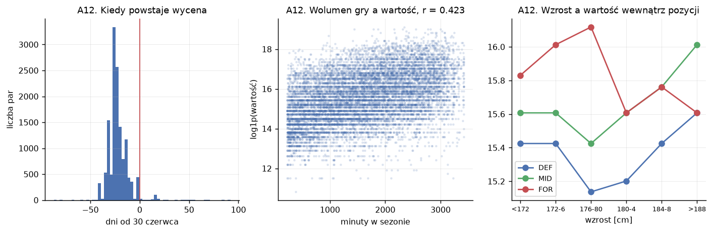

*Trzy ciekawostki obok siebie. Po lewej rozkład odległości daty wyceny od
30 czerwca, z pionową linią w zerze; skupiska słupków zdradzają hurtowy
charakter aktualizacji. W środku minuty wobec wartości
(r = 0,423, najsilniejsza korelacja w zbiorze). Po prawej wzrost wobec wartości
liczony wewnątrz pozycji, gdzie globalne zero rozpada się na +0,077 u obrońców
i −0,090 u napastników.*

Tabela: `a12_korelacje_z_celem.csv`.

## Co z tego wynika dla kolejnych etapów

Dla E4, protokół walidacji:

- GroupKFold po `player_id` na 3 598 grupach w treningu, przy 2,20 wiersza na
  grupę.
- Ziarnistość celu (119 progów, 44,6 procent masy w dziesięciu z nich) wchodzi do
  dyskusji o dolnym ograniczeniu RMSLE.
- Poziom odniesienia M0c obejmuje 72,0 procent testu i daje R² 0,807 na
  podzbiorze z dostępnym t−1; obie liczby potwierdzone niezależnie od D-06.
- Sufit informacyjny 0,313 dla samego kontekstu i około 0,72 dla pełnego zestawu
  cech wyznacza skalę, w której należy czytać wyniki E5.

Dla E5, modele:

- Cechy ze zmienioną definicją wymagają decyzji przed treningiem (O-6). Dotyczy
  to przede wszystkim pary wskaźników dryblingu, gdzie granica zmiany pokrywa się
  z granicą podziału.
- Filtr korelacyjny przy progu 0,95 kosztuje 0,15 R² na modelu liniowym, więc
  jego uzasadnieniem jest stabilność wyjaśnień w W4, a nie dokładność w W1.
- Para `total_touches` i `live_ball_touches` wymaga rozstrzygnięcia niezależnie od
  filtra, ponieważ są to duplikaty.
- Dane przemawiają za wariantem „flaga zero prób obok imputacji" z O-3, ponieważ
  braki koncentrują się w jednej pozycji (iloraz 28,7 między obrońcami
  a napastnikami).
- `minuty_sezon` zdominuje ranking ważności; interpretacja przyczynowa tej cechy
  jest w pracy wykluczona.

Dla E8 i E10, niepewność i sprawiedliwość:

- Przewidywanie do sprawdzenia: pokrycie konforemne na teście wyjdzie poniżej
  nominalnego z powodu różnicy składu znani/nowi między kalibracją (79,2 procent)
  a testem (66,2 procent).
- Premie warunkowe regionów (+40 procent dla Ameryki Południowej, −19 procent dla
  reszty świata) to punkt odniesienia dla W5: model wierny danym odtworzy je
  i pokaże zerową dysproporcję błędu.
- Krzywa wieku zniekształcona filtrem minut wymaga raportowania W5 w rozbiciu na
  przedziały wieku.

## Ograniczenia tej analizy

Próg minut poniżej 225 pozostaje niezbadany, ponieważ zbiór modelowy jest już
odfiltrowany. Pełna analiza wrażliwości wymaga przebiegu pipeline z innym
`MIN_MINUT`.

Ocena jakości modeli w A6 i A9 liczona jest na zbiorze kalibracyjnym, żeby
oszczędzić zbiór testowy. Liczby te są orientacyjne wobec tego, co pokaże E5 na
teście, i różnią się od nich o wielkość przesunięcia między sezonem 2022-2023
a 2023-2024. Modele użyte w tych sekcjach służą wyłącznie pomiarowi sufitu
i kosztu filtra, bez strojenia hiperparametrów.

Zmienna celu zbioru C nie była analizowana. Liczby o poziomie wycen w Primeira
Lidze cytowane w tym dokumencie pochodzą z zapisów w `02-dane.md` i D-14.

Hipoteza o zmianie definicji w źródle (A11) opiera się na kształcie szeregu
czasowego, na rozdzieleniu licznika od mianownika oraz na złamaniu tożsamości
księgowej między dwoma wskaźnikami. Wskazanie konkretnej przyczyny po stronie
dostawcy wymagałoby dokumentacji FBref albo porównania z niezależnym źródłem, co
pozostaje poza zakresem pracy.

## Powiązane dokumenty

- `01-projekt.md` — cel pracy, wymiary W1–W6, modele
- `02-dane.md` — źródła, pipeline, słownik zbioru, ograniczenia
- `03-decyzje.md` — log decyzji projektowych
- `04-plan.md` — mapa drogowa i status
